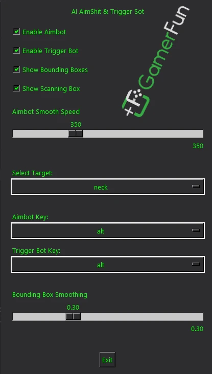

# AI Aimbot and Trigger Bot

A real-time, AI-powered aimbot and trigger bot leveraging NVIDIA TensorRT for fast deep learning inference. This tool captures a specific screen region, detects targets using a neural network, and automatically moves the mouse and triggers actions. It includes an overlay and a Tkinter control panel for real-time visual feedback and customizable settings.

> **⚠️ Disclaimer:**  
> **This software is for educational and experimental purposes only. Use it only where you have explicit permission. Misuse may violate terms of service or laws. The author is not responsible for any consequences.**

---

## Previous Project & Resources

If you're familiar with my previous project featuring YOLO-based AimBot, TriggerBot, and Recoil Control, you can check it out here:

- **Official Website:** [GamerFun](https://www.gamerfun.club/ai-aimbot-triggerbot-shooter-games)
- **Forum Discussion:** [UnknownCheats](https://www.unknowncheats.me/forum/rainbow-six-siege/671029-gamerfun-ai-menu-mouse-aimbot-triggerbot-recoil-control-using-lgub-drivers.html)
- **GitHub Repository:** [Your GitHub Repo](https://github.com/YourUsername/your-repo-name)

This release focuses exclusively on **AimBot** and **TriggerBot**, with significantly improved speed and accuracy.

---

## Features

- **AI-Powered Target Detection:** Uses a pre-trained model with TensorRT for high-speed inference.
- **Real-Time Screen Capture:** Captures specific screen regions using `mss`.
- **Customizable Overlay:** Displays scanning areas and detected targets via a transparent Tkinter overlay.
- **Control Panel:** Configure:
  - Aimbot and trigger bot toggle.
  - Aimbot speed adjustments.
  - Target area selection (head, neck, chest, legs, etc.).
  - Custom key bindings.
- **Keyboard & Mouse Handling:** Uses `pynput` to manage key and mouse events.
- **Mouse Driver Integration:** Uses Logitech-CVE mouse driver (`ghub_mouse.dll`) from [ekknod on GitHub](https://github.com/ekknod/logitech-cve) for precise control.

---

---

## Prerequisites

### Hardware & Software Requirements

- **Operating System:** Windows 10  
- **GPU:** NVIDIA GPU with CUDA support  
- **Python:** 3.10+  
- **NVIDIA Software:** CUDA Toolkit & TensorRT SDK  

> **Important:** TensorRT Python bindings come with the SDK and are not available on PyPI.

### Required Downloads:

- **CUDA 12.4 Toolkit:** [Download Here](https://developer.nvidia.com/cuda-12-4-0-download-archive)
- **TensorRT 10.7 GA (CUDA 12.0-12.6, Windows):** [Download ZIP](https://developer.nvidia.com/downloads/compute/machine-learning/tensorrt/10.7.0/zip/TensorRT-10.7.0.23.Windows.win10.cuda-12.6.zip)
- **Logitech G HUB (2021-10-8013)** (Required even if you don’t own a Logitech mouse):  
  [Download Here](https://www.unknowncheats.me/forum/downloads.php?do=file&id=39879)

---

## Installation

### 1️⃣ Clone the Repository:
```
git clone https://github.com/WANASX/tensorrt-ai-aimbot-triggerbot.git
cd tensorrt-ai-aimbot-triggerbot
```

### 2️⃣ Install Dependencies:
```
pip install -r requirements.txt
```

### 3️⃣ Set Up TensorRT & CUDA:
- Ensure CUDA Toolkit and TensorRT SDK are installed and properly configured.

### 4️⃣ Prepare Required Files:
- Place your **TensorRT engine file** (e.g., `model_fp16_320.trt`) in the project root.
- Ensure the **mouse_driver** directory contains:
  - `ghub_mouse.dll`
  - `ghub_mouse.py`

---

## Setting Up TensorRT

### Extract the TensorRT ZIP Package:
1. Right-click the downloaded ZIP → **Extract All...**
2. Choose a destination (e.g., `C:\TensorRT-10.7`).

### Add TensorRT to Environment Variables:
1. **Open System Properties** → **Advanced** → **Environment Variables**
2. Under **System Variables**, select **Path** → **Edit**
3. Click **New** and add:
   ```
   C:\TensorRT-10.7\lib
   ```
4. Set `TENSORRT_HOME` Variable:
   - Click **New** (under System Variables)
   - **Variable Name:** `TENSORRT_HOME`
   - **Variable Value:** `C:\TensorRT-10.7`

### Install TensorRT Python Wheel:
1. Open **Command Prompt** in the extracted TensorRT `python` directory:
   ```
   cd C:\TensorRT-10.7\python
   ```
2. Install TensorRT:
   ```
   pip install tensorrt-10.7.0-cp310-none-win_amd64.whl
   ```
   *(Replace the `.whl` filename based on your Python version.)*

---

## Convert & Run the AI Model

### Extract GamerFun Menu Files:
1. Open **CMD** in the extracted folder.
2. Run the following command to convert the AI model:
   ```
   python convert_to_trt.py model1_320.onnx model_fp16_320.trt --fp16
   ```
3. Wait for the process to complete.

### Launch the Application:
```
python TensorRT.py
```
4. **Customize settings in the menu.**
5. **Enjoy! 🎯**

---

## Usage

### Control Panel & Overlay:
- The overlay displays scanning areas and detected targets.
- The control panel allows you to:
  - Enable/disable aimbot and trigger bot.
  - Adjust aimbot speed.
  - Select target areas (head, neck, chest, legs, etc.).
  - Configure key bindings (default: **Alt** for aimbot, **X** for trigger bot).

### Operation:
- **Aimbot:** Moves the mouse toward detected targets.
- **Trigger Bot:** Simulates mouse clicks when a target is detected.
- **Key Bindings:** Can be customized via the control panel.

### Exit:
- Click the **Exit** button in the control panel to safely close the application.

---
[](https://www.youtube.com/watch?v=YfbQEHXRf6rc)
---

## Troubleshooting

- **TensorRT/CUDA Issues:** Ensure CUDA and TensorRT are installed correctly and accessible in Python.  
- **Mouse Driver Errors:** Verify `ghub_mouse.dll` is in `mouse_driver` and compatible with your system.  
- **Screen Capture Problems:** Check that `mss` is functioning properly and that the capture region is correctly defined.  

---

## Contributing

Contributions are welcome! Feel free to open an issue or submit a pull request for enhancements or bug fixes.

---

## License

This project is licensed under the **MIT License**. See the `LICENSE` file for details.

---

## Support & Donations

If you would like to support this project, you can donate **USDT Tron (TRC20)** to:
```
TDiVQzShforoR5XgWXfKuPhPhdgPypXAgB
```

For questions or support, contact **support@gamerfun.club**.
